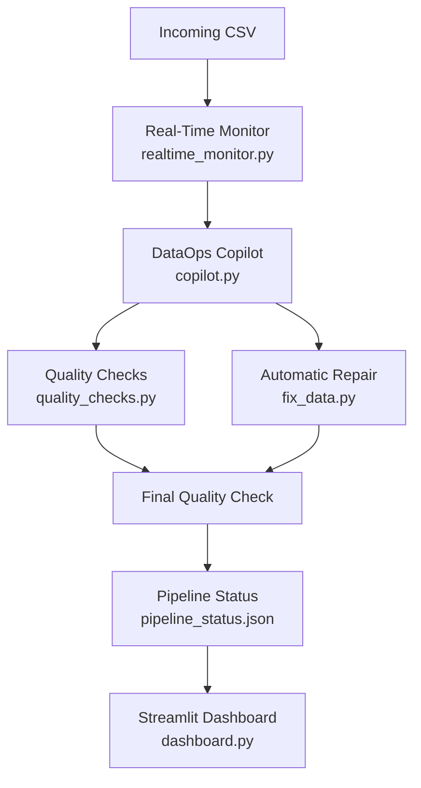

# 📊 DataOps Copilot

**Automated data-quality monitoring, repair, and validation for incoming CSV datasets.**

DataOps Copilot watches an `incoming/` folder, runs a customer dataset through a quality-check → auto-repair → re-validate pipeline, and reports the result on a live Streamlit dashboard — so nobody has to eyeball a CSV before it hits production.

[](https://www.python.org/)
[](https://streamlit.io/)
[](https://pandas.pydata.org/)
[](#-license)

**[🚀 Live Dashboard](https://dataops-copilot.streamlit.app/)** · **[📄 Source Code](https://github.com/mudagantisahithi-sketch/dataops-copilot)**

---

## Table of Contents

- [Overview](#-overview)
- [The Problem](#-the-problem)
- [Features](#-features)
- [Architecture](#-architecture)
- [Quick Start](#-quick-start)
- [Usage](#-usage)
  - [Run the pipeline once](#run-the-pipeline-once)
  - [Run real-time monitoring](#run-real-time-monitoring)
  - [Run the dashboard](#run-the-dashboard)
- [Example Run](#-example-run)
- [Project Structure](#-project-structure)
- [Tech Stack](#-tech-stack)
- [Known Limitations](#-known-limitations)
- [Roadmap](#-roadmap)
- [What This Project Demonstrates](#-what-this-project-demonstrates)
- [Author](#-author)

---

## 📌 Overview

Instead of manually inspecting every CSV file before it moves downstream, DataOps Copilot automates the whole quality-control workflow:


It combines three pieces:

| Component | File | Role |
|---|---|---|
| Pipeline orchestrator | `copilot.py` | Runs quality checks → repair → re-validation for a single file |
| Real-time watcher | `realtime_monitor.py` | Polls `incoming/` and triggers the pipeline on new CSVs |
| Dashboard | `dashboard.py` | Streamlit UI that reads `pipeline_status.json` and shows live progress |

## 🎯 The Problem

Incoming customer datasets can silently contain:

- Missing customer IDs
- Duplicate customer IDs
- Missing email addresses

If these aren't caught before downstream processing, they cause incorrect analytics, failed transformations, or unreliable business data. **The goal: catch data-quality issues automatically, before the dataset moves downstream — and fix what can be fixed without a human in the loop.**

## ✨ Features

| Feature | Description |
|---|---|
| 🔍 Quality Checks | Detects missing IDs, duplicate IDs, and missing emails |
| 🤖 Automatic Repair | Fixes missing customer IDs by generating the next available `CUSTxxxxx` ID |
| ⚡ Real-Time Monitoring | Watches `incoming/` and kicks off the pipeline as soon as a new CSV lands |
| 📊 Quality Score | Calculates an overall pass/fail percentage across all checks |
| ✅ Final Validation | Re-runs quality checks on the repaired dataset to confirm the fix worked |
| 📈 Streamlit Dashboard | Live, auto-refreshing view of pipeline stage, score, and dataset info |
| 📝 Pipeline Status | Every run's state is persisted to `pipeline_status.json` |

## 🏗️ Architecture



## 🚀 Quick Start

```bash
# 1. Clone the repository
git clone https://github.com/mudagantisahithi-sketch/dataops-copilot.git
cd dataops-copilot

# 2. Create a virtual environment
python -m venv .venv

# 3. Activate it
# Windows (PowerShell)
.\.venv\Scripts\Activate.ps1
# macOS / Linux
source .venv/bin/activate

# 4. Install dependencies
pip install -r requirements.txt
```

> ⚠️ **Heads up:** the `requirements.txt` currently in the repo appears to be saved in UTF-16 encoding, which makes `pip install -r requirements.txt` fail on most systems (`ERROR: Invalid requirement`). Re-save it as plain UTF-8, or generate a fresh one with `pip freeze > requirements.txt` from a working environment. See [Known Limitations](#-known-limitations).

### (Optional) Generate sample data

```bash
python generate_data.py       # creates data/customers.csv (1,000 clean rows)
python create_bad_data.py     # creates data/customers_bad_nulls.csv (100 missing IDs)
```

## 🖥️ Usage

### Run the pipeline once

Process a specific CSV through the full check → repair → validate flow:

```bash
python copilot.py incoming/customers_bad_nulls.csv
```

This runs:

```
Initial Quality Check → Automatic Repair → Final Quality Check → Pipeline Completion
```

and writes the result to `pipeline_status.json`.

### Run real-time monitoring

Start the watcher, which polls `incoming/` every 2 seconds:

```bash
python realtime_monitor.py
```

```
============================================================
       DATAOPS COPILOT - REAL-TIME PIPELINE
============================================================

Watching folder: incoming
Drop a CSV file into the incoming folder.
The pipeline will automatically process new files.
Press Ctrl+C to stop.
```

Drop any CSV into `incoming/` and the pipeline runs automatically.

### Run the dashboard

```bash
streamlit run dashboard.py
```

Open **http://localhost:8501** to see live pipeline status, quality score, stage-by-stage progress, and dataset info — refreshing automatically while a run is in progress.

A hosted version is also available at **[dataops-copilot.streamlit.app](https://dataops-copilot.streamlit.app/)**.

## 📊 Example Run

A test dataset with 1,000 rows and 100 missing customer IDs, processed end-to-end:

**Before repair**

| Metric | Value |
|---|---|
| Rows | 1,000 |
| Missing Customer IDs | 100 |
| Duplicate IDs | 0 |
| Missing Emails | 0 |
| **Quality Score** | **66.67%** |
| **Status** | **FAILED** |

The pipeline detects the missing IDs and runs `fix_data.py` automatically.

**After repair**

| Metric | Value |
|---|---|
| Rows | 1,000 |
| Missing Customer IDs | 0 |
| Duplicate IDs | 0 |
| Missing Emails | 0 |
| **Quality Score** | **100.00%** |
| **Status** | **PASSED** |

**Result: 66.67% → 100.00%**, and `pipeline_status.json` reflects the final state:

```json
{
    "status": "PASSED",
    "stage": "COMPLETED",
    "message": "Pipeline completed successfully",
    "score": 100.0,
    "input_file": "customers_bad_nulls.csv",
    "rows": 1000,
    "error": null
}
```

## 📁 Project Structure

```
dataops-copilot/
│
├── copilot.py              # Pipeline orchestrator (check → repair → validate)
├── realtime_monitor.py      # Watches incoming/ and triggers the pipeline
├── dashboard.py              # Streamlit dashboard
│
├── quality_checks.py         # Runs the 3 quality checks + scoring
├── fix_data.py                # Repairs missing customer IDs
│
├── generate_data.py           # Generates clean sample data
├── create_bad_data.py          # Injects missing IDs into sample data
├── inspect_data.py              # Quick CSV inspection helper
│
├── requirements.txt
├── README.md
├── .gitignore
│
├── .streamlit/
│   └── config.toml
│
├── incoming/                   # Drop new CSVs here (git-ignored)
├── data/                       # Working + cleaned datasets (git-ignored)
└── reports/                    # Quality reports (git-ignored)
```

## 🧰 Tech Stack

- **Core:** Python, Pandas
- **Dashboard:** Streamlit
- **Automation:** `subprocess`, `pathlib`-based polling, JSON pipeline status
- **Dev:** Git, GitHub, virtual environments

## ⚠️ Known Limitations

- **`requirements.txt` encoding:** the file in the repo is UTF-16, which breaks `pip install -r requirements.txt` on most setups. Re-save as UTF-8.
- **`fix_data.py` uses a hardcoded input path** (`data/customers_bad_nulls.csv`) rather than the file `copilot.py` actually passes through the pipeline. For now, the repair step reliably fixes only that specific filename — worth parameterizing if you plan to run the pipeline against other files.
- **Repair coverage:** only missing customer IDs are auto-fixed today. Duplicate IDs and missing emails are detected and scored, but not yet repaired automatically.
- **Local-only real-time monitoring:** `realtime_monitor.py` polls a local folder; it isn't wired up to cloud storage triggers yet (see Roadmap).

## 🔮 Roadmap

- [ ] Kafka-based event streaming
- [ ] Google Cloud Storage triggers
- [ ] BigQuery integration
- [ ] Auto-repair for duplicate IDs and missing emails
- [ ] Configurable quality rules
- [ ] Email and Slack alerts
- [ ] Historical quality metrics and trend dashboards
- [ ] Large-file, distributed processing
- [ ] Authentication and role-based access
- [ ] Automated testing and CI/CD

## 🎓 What This Project Demonstrates

- Data quality engineering and automated validation
- Python data processing with Pandas
- Real-time pipeline design (file-watching + orchestration)
- Streamlit application development
- JSON-based status tracking between processes
- End-to-end ETL concepts, from ingestion to dashboarding

## 👩‍💻 Author

**Sahithi Mudaganti**
GitHub: [@mudagantisahithi-sketch](https://github.com/mudagantisahithi-sketch)
